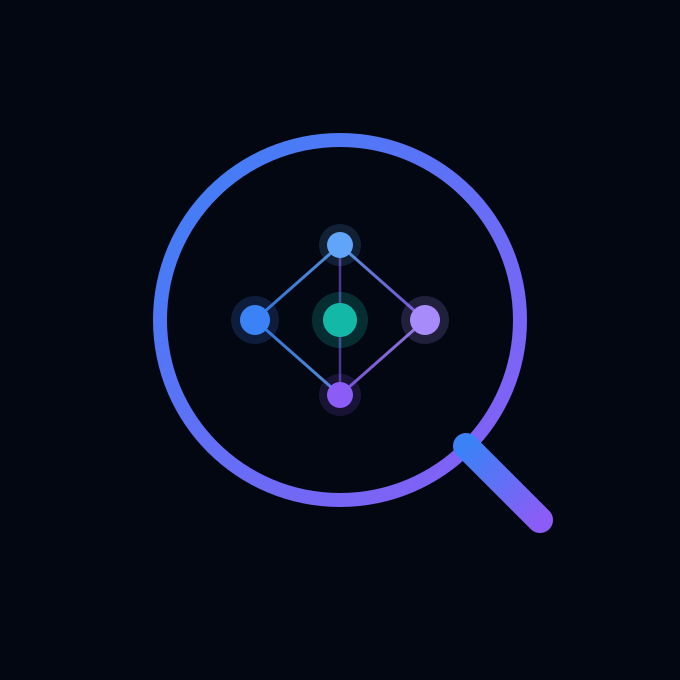

<div align="center">
  

  <h1>ProductIQ</h1>
  <p><strong>AI-powered multimodal product intelligence — the official Next.js client for the 5-agent pipeline</strong></p>

  <p>
    <a href="https://multimodal-ai-platform.netlify.app"></a>
    
    
    
    
    
  </p>

  <p>
    <a href="https://multimodal-ai-platform.netlify.app">Live Demo</a>
    ·
    <a href="https://abdullah-05-multimodal-product-intelligence-api.hf.space/docs">API Docs</a>
    ·
    <a href="https://github.com/Abdullah-Masood-05/multimodal-product-intelligence-api">Backend Repo</a>
  </p>
</div>

---

## Features

This application features 5 distinct modules accessible via a top-level tab navigation, each corresponding to an AI Agent:

- 🔍 **Product Analysis (Agent 1)**: Drag-and-drop image upload that instantly returns structured JSON metadata (titles, descriptions, tags) and flags visual duplicates in real-time using vector similarity.
- 📊 **Market Researcher (Agent 2)**: Scans a target product against a Qdrant vector database of competitors, returning Market Positioning, Average Market Price, and individual competitor Threat Levels.
- 🤖 **Twin Simulator (Agent 3)**: The ultimate "recruiter bait". Upload a product and the AI generates synthetic shopper personas (twins), simulates their emotional reactions, and calculates their purchase probability.
- 💰 **Pricing Strategist (Agent 4)**: A calculator interface that ingests Market Data and Customer Twin Data to determine the mathematically ideal Price Point and Margin Risk.
- 📢 **Ad Campaign Builder (Agent 5)**: Enter a budget and target audience, and the backend uses concurrent threading to instantly write 5 bespoke marketing campaigns (Facebook, Instagram, Google Shopping, WhatsApp, Email).
- 🌙 **Dark mode by default** with a persistent light-mode toggle (no flash on reload).

## Tech Stack

- **Framework**: Next.js 16 (App Router, static export)
- **Language**: TypeScript
- **Styling**: Tailwind CSS 4
- **Icons**: Lucide React
- **Upload**: React Dropzone
- **HTTP Client**: Axios

## Quick Start

### Prerequisites
- Node.js 20+ (or Bun)
- The Backend API running locally at `http://localhost:8000`

### 1. Install Dependencies
```bash
npm install   # or: bun install
```

### 2. Configure Environment
Create a `.env.local` file in the root directory:
```bash
NEXT_PUBLIC_API_URL=http://localhost:8000
```

### 3. Run the Development Server
```bash
npm run dev   # or: bun run dev
```

The application will be available at `http://localhost:3000`.

## Deployment (Netlify)

The app is a pure client-side static export (`output: "export"`), deployed to **Netlify** at [multimodal-ai-platform.netlify.app](https://multimodal-ai-platform.netlify.app). `netlify.toml` already sets `NEXT_PUBLIC_API_URL` to the hosted API on Hugging Face Spaces.

To deploy your own:

1. Push this repo to GitHub and import it in Netlify (it reads `netlify.toml` automatically), **or**
2. Deploy from the CLI:
   ```bash
   npm run build
   netlify deploy --prod --dir out
   ```

## Project Structure

```text
├── src/
│   ├── app/
│   │   ├── layout.tsx             ← Root layout, theme init & fonts
│   │   ├── page.tsx               ← Main application holding the 5 Tab views
│   │   └── globals.css            ← Global styles & dark-mode variant
│   ├── components/
│   │   ├── ThemeToggle.tsx        ← Dark/light mode switch
│   │   ├── DropZone.tsx           ← Agent 1 Upload
│   │   ├── ResultPanel.tsx        ← Agent 1 Results
│   │   ├── MarketResearcher.tsx   ← Agent 2 Upload
│   │   ├── MarketResults.tsx      ← Agent 2 Results
│   │   ├── TwinSimulator.tsx      ← Agent 3 Upload
│   │   ├── TwinResults.tsx        ← Agent 3 Results
│   │   ├── PricingStrategist.tsx  ← Agent 4 Upload
│   │   ├── PricingResults.tsx     ← Agent 4 Results
│   │   ├── CampaignBuilder.tsx    ← Agent 5 Upload
│   │   └── CampaignResults.tsx    ← Agent 5 Results
│   └── lib/
│       └── api.ts                 ← Axios API configuration & endpoints
├── public/
│   ├── logo.svg                   ← ProductIQ logo
│   └── logo.png
├── netlify.toml
└── package.json
```

## License

MIT
